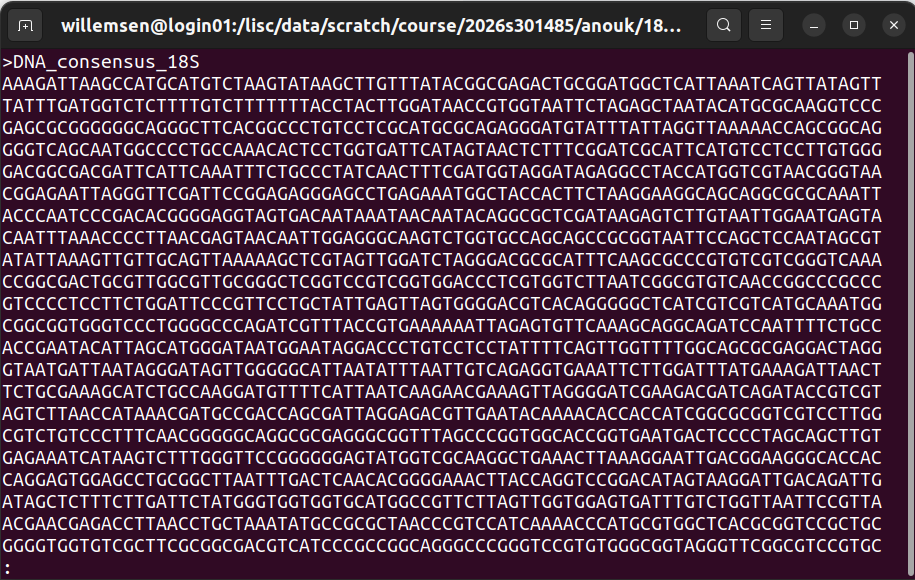
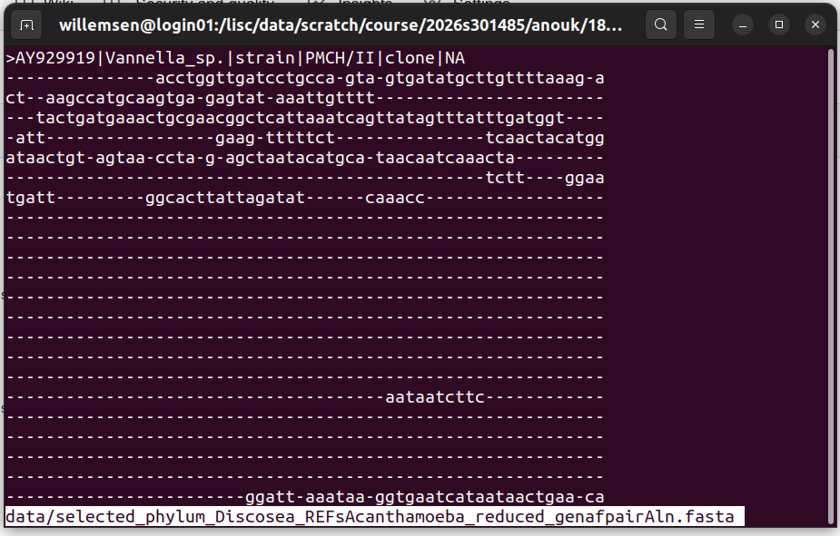

# Exercise_1: Analyse 18S sequencing data

## Create a consensus sequence
In this exercise, we will create a consensus sequence from multiple Sanger sequencing reads.

&rarr; Before starting this exercise, please create an account in Benchling: https://benchling.com/signup/welcome
</br>
&rarr; If you do not have one, please install a text editor on your computer. For example, gedit: https://gedit-text-editor.org/install.html


1. Log in to your Benchling account and make a project folder
2. Go to `DNA/RNA sequence` &rarr; `New DNA/RNA alignment`
4. Import the Sanger sequencing data (*.ab1 files) by creating a consensus alignment with MAFFT
5. Analyse your results
   - Look at the chromatograms
   - Look at mismatches
   - Trim off low-quality ends
6. Export your consensus sequence in FASTA format (use the `i` button on the right menu)

<details>

<summary>This is how your alignment should look </summary>


   

   

   
</details>
</br>

## Find out the organism through BLAST

1. First, inspect your consensus sequence (FASTA file) in a text editor
2. Perform blast-based searches using reference databases. You can do this online: https://blast.ncbi.nlm.nih.gov/Blast.cgi

**Questions**:</br>
`Which type of BLAST did you use, and why?`</br>
`What are the criteria of a good blast hit?`</br>
`Which organism gave the best hit?`</br>

<details>

<summary>This is an example fasta file </summary>


</details>
</br>

## Find out the organism through phylogenetic analysis

The rest of the analyses will happen on LiSC. Here is a quick starter guide in case you haven't read it:

[LiSC Starter Guide](https://wiki.lisc.univie.ac.at/access/gettingstarted/tutorial)

Read that and continue here.
</br>
</br>

**SSH Login**

To log in to LiSC, open a terminal (for example [`tabby`](https://tabby.sh/)) and run the following command, where `<user>` is your personal user login:
```bash
ssh <user>@login01.lisc.univie.ac.at
```
This will (if it is your first login) prompt the following output:
```bash
The authenticity of host 'login01.lisc.univie.ac.at (131.130.65.101)' can't be established.
ED25519 key fingerprint is SHA256:TktqgkGsuDaxZ1df2g9w2P12jm3s6d7ayFw0NZ4NzlQ.
This key is not known by any other names.
Are you sure you want to continue connecting (yes/no/[fingerprint])? 
```
Then it will ask for your password (the one you set up and that is connected to your `<USER>`). Type it in and don't worry that you can't see what's being written; that's normal for passwords in the terminal.
Hit ENTER, and here we go! You are now logged in to the LiSC server!
</br>
</br>

### Implement the project structure

In our course directory (`/lisc/data/scratch/course/2026s301485/`), create the folder `<USER>` (replace `<USER>` with your username) and go into it.

<details>  
<summary>See commands</summary>

```bash
cd /lisc/data/scratch/course/2026s301485/
```
```bash
mkdir <USER>
cd  <USER>
```   
</details>

Once in that directory, we will create the directory structure so we can work in a nice environment 😉.
```bash
<USER>
└── 18S_analysis
    ├── data            # store original downloaded 'raw' data
    ├── processed_data # store processed input sequence and metadata files
    ├── scripts         # store all scripts
    ├── tmp             # store all intermediate files (those which do not get used by downstream software)
    └── tree            # store tree-related files
```

<details>
<summary>See commands</summary>

```bash
# Make <USER>/18S_analysis directory and change to it
mkdir 18S_analysis
cd 18S_analysis
```

**Make directories inside of ~/2026s301485/18S_analysis**
```bash
mkdir data
mkdir processed_data
mkdir scripts
mkdir tmp
mkdir tree
```

### Visualise your directory structure
```bash
tree .
```
</details>

Copy the necessary files into your `<USER>/18S_analysis/data` directory

<details>
<summary>See commands</summary>

```bash
# Copy the DNA consensus file you made
scp DNA_consensus_18S.fasta <USER>@login01.lisc.univie.ac.at:/lisc/data/scratch/course/2026s301485/<USER>/18S_analysis/data/;
```
### Copy the provided alignment
```bash
scp ../../provided_data/selected_phylum_Discosea_REFsAcanthamoeba_reduced_genafpairAln.fasta data/;
```
</details>

</br>

### Inspect data files

Make sure we are inside our working directory

```bash
pwd
```
Output should show `/lisc/data/scratch/course/2026s301485/<USER>/18S_analysis/`.

```bash
less data/DNA_consensus_18S.fasta;
```
- Click <kbd>↑</kbd> and <kbd>↓</kbd> to navigate through the file visualisation.

- Click <kbd>Q</kbd> to exit the viewing.

<details>

<summary>See output</summary>



</details>
</br>


```bash
less data/selected_phylum_Discosea_REFsAcanthamoeba_reduced_genafpairAln.fasta
```

<details>

<summary>See output</summary>



</details>
</br>

Count the number of sequences in each fasta file
```bash
grep -c ">" ../data/*.fasta
```
</br>


### Add your sequence to an existing alignment
We know from our BLAST analysis that our organism is most likely a member of the family *Anthamoeba* within the phylum *Discosea*. Since we have only a partial 18S rRNA sequence, we will add our DNA fragment to an existing alignment of *Discosea* from the supplementary data of Willemsen *et al.*(2025). doi: [10.1093/gbe/evae271](https://doi.org/10.1093/gbe/evae271). We will align our DNA sequence using [MAFFT](https://mafft.cbrc.jp/alignment/software/).

Change to the tree directory
```bash
cd tree
```

Let's first load our alignment software.
```bash
module load MAFFT
```
Now add our DNA sequence to the existing alignment
```bash
mafft --auto --addfragments ../data/DNA_consensus_18S.fasta --thread 2 ../data/selected_phylum_Discosea_REFsAcanthamoeba_reduced_genafpairAln.fasta > selected_phylum_Discosea_REFsAcanthamoeba_reduced_genafpairAln_addFrag.fasta
```
</br>

View alignment
Let's take a look at our alignment using [Aliview](https://github.com/AliView/AliView), a lightweight alignment viewer/editor.

Here are the download links for three different operating systems.
- Windows - http://www.ormbunkar.se/aliview/downloads/linux
- OsX - http://www.ormbunkar.se/aliview/downloads/mac
- Linux - http://www.ormbunkar.se/aliview/downloads/windows

But then we need to copy over the files to our local machine:
```bash
scp <user>@login01.lisc.univie.ac.at:/lisc/data/scratch/course/2026s301485/<USER>/18S_analysis/tree/selected_phylum_Discosea_REFsAcanthamoeba_reduced_genafpairAln_addFrag.fasta .
```
Have a look at the alignment!

</br>

Trim alignment
As you've seen, there are overhangs and big gaps, which create noise in our alignment and, therefore, in the tree. Note that this step needs careful consideration; in some cases keeping overhangs/gaps is fine and actually the _correct_ way. 

For now, let's trim. We are going to use `trimal` for that. 

```
module load trimAl

trimal -in selected_phylum_Discosea_REFsAcanthamoeba_reduced_genafpairAln_addFrag.fasta -out selected_phylum_Discosea_REFsAcanthamoeba_reduced_genafpairAln_addFrag_trimmed.fasta -automated1
```

- Have a look at the alignment again! Did that work? Are we happy with the alignment as it is?

</br>

### Phylogenetic tree calculation

Tree calculation requires substantial computational power and addresses a complex bioinformatics problem. We are using `iqtree3`. Learn about what happens behind the scenes here:

https://iqtree.github.io/doc/Tutorial

These are the commands we will be running, which take ~10 min. So grab a coffee :). 

```bash
module load IQ-TREE
```
```bash
iqtree3 -s selected_Discosea_genafpairAln_manCur_addFrag.fasta \
-seed 145693 \
-B 1000 \
-v \
-T 2 \
--prefix selected_Discosea_genafpairAln_manCur_addFrag_tree
```

Here's the breakdown of the command:

| Parameter | Description |
|-----------|-------------|
| `-s alignment.fasta` | Your input alignment file(s). |
| `-seed NUM` | Random seed number, normally used for debugging purposes. |
| `-B 1000` | Performs **1,000 ultrafast bootstrap replicates** to assess branch support quickly and accurately. |
| `-v` | Verbose mode, printing more messages to screen. |
| `-T 2` | Uses **2 threads** for parallel computation. |
| `--prefix *_tree` | Sets the output file prefix. |

</br>

Copy over the tree file to our local machine:
```bash
scp <user>@login01.lisc.univie.ac.at:/lisc/data/scratch/course/2026s301485/<USER>/18S_analysis/tree/*.treefile .
```

</br>


### Tree visualisation

For this, we will use a web tool: [**iTOL**](https://itol.embl.de/) 

Log in (top right) with the user **"veelab_students"**. The password is shared in the class.  
<p align="left">
  
</p>

Then go create your own workspace.  
<p align="left">
  
</p>

Then try to do these steps, but also feel free to just play around:
- **Upload** your tree files (`<something>.treefile`), which are saved in Newick format.
- Have a look at the tree **layouts**.
- Have a look at midpoint **rooting**.
- Have a look at bootstrap **support** values.
- Where does your sequence cluster?
- Can you say with certainty what host species/strain you have?

<br>
