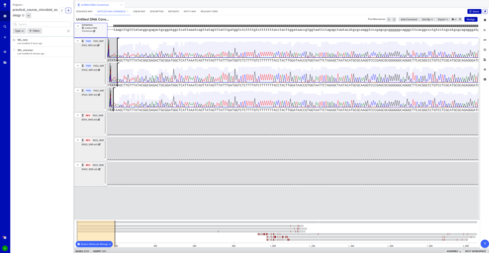
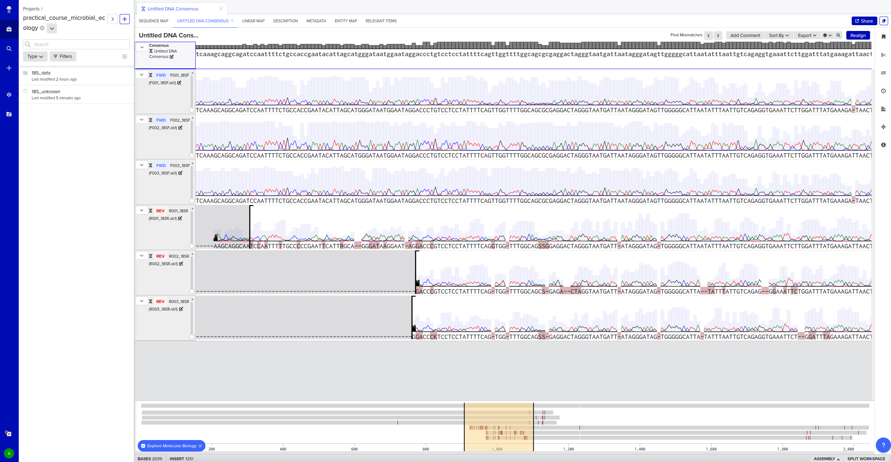
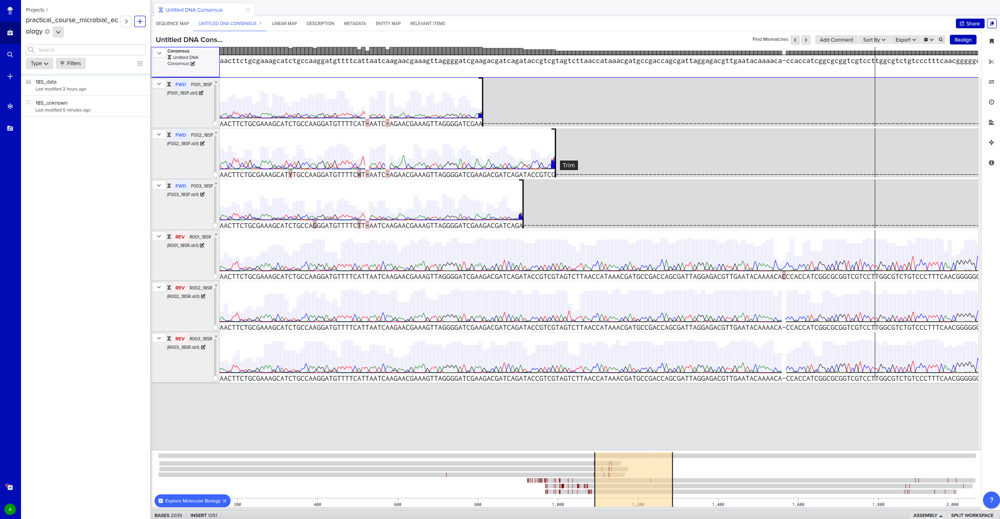
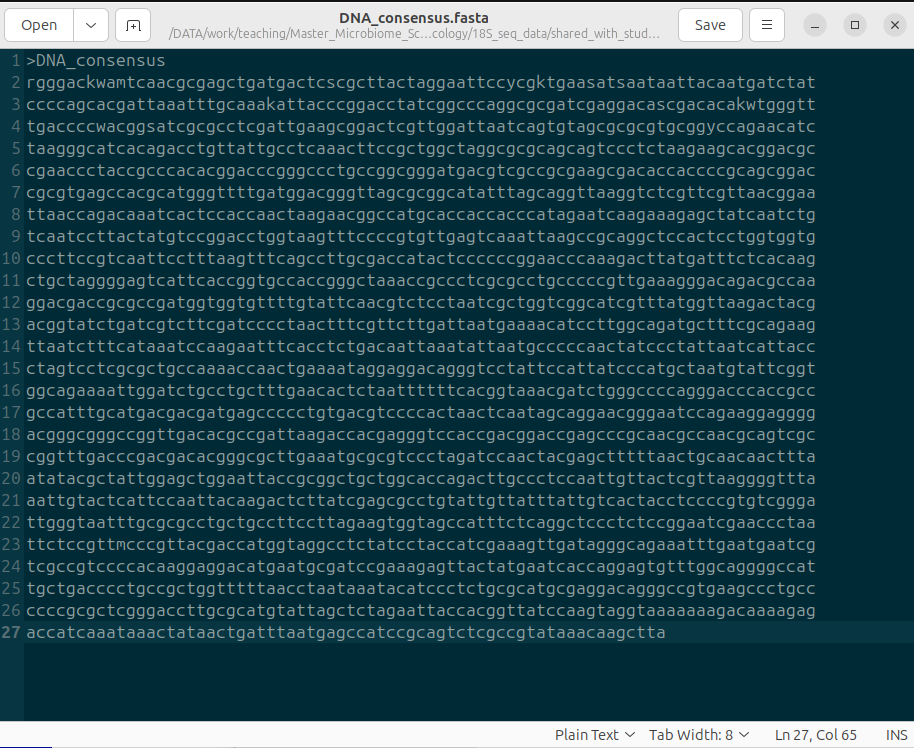

# Exercise_1: Analyse 18S sequencing data

## Create a consensus sequence
In this exercise, we will create a consensus sequence from multiple Sanger sequencing reads.

&rarr; Before starting this exercise, please create an account in Benchling: https://benchling.com/signup/welcome
 
&rarr; If you do not have one, please install a text editor on your computer. For example, gedit: https://gedit-text-editor.org/install.html

1. Log in to your Benchling account and make a project folder
2. Go to `DNA/RNA sequence` &rarr; `New DNA/RNA alignment`
4. Import the Sanger sequencing data (*.ab1 files) by creating a consensus alignment with MAFFT
5. Analyse your results
   - Look at the chromatograms
   - Look at mismatches
   - Trim off low-quality ends
6. Export your consensus sequence in FASTA format (use the `i` button on the right menu)

This is how your alignment should look 

   

   

   

 

## Find out the organism through blast

1. First, inspect your consensus sequence (FASTA file) in a text editor
2. Perform blast-based searches using reference databases. You can do this online: https://blast.ncbi.nlm.nih.gov/Blast.cgi

**Questions**: 
`Which type of blast did you use, and why?` 
`What are the criteria of a good blast hit?` 
`Which organism gave the best hit?` 

This is an example fasta file 

 

## Find out the organism through phylogenetic analysis

