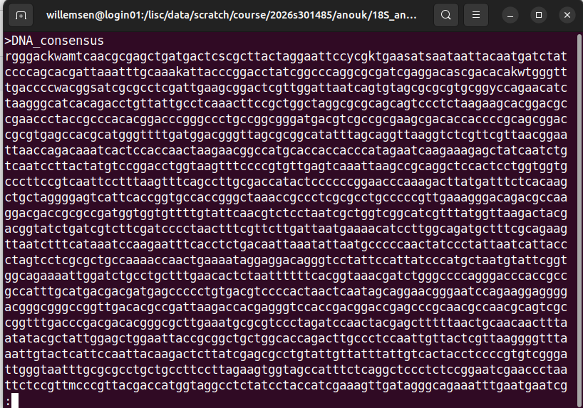
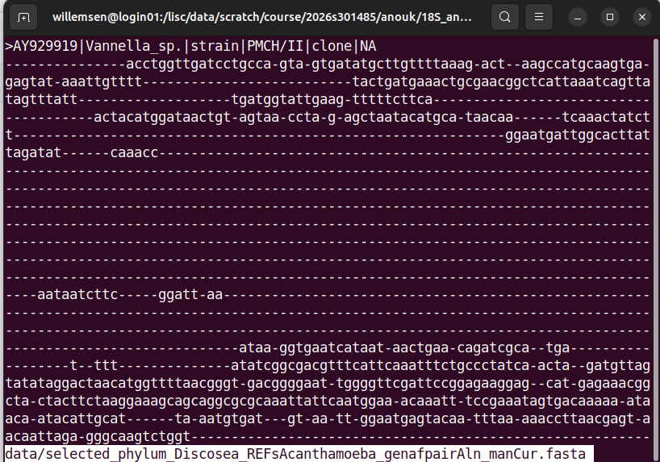

# Exercise_1: Analyse 18S sequencing data

## Create a consensus sequence
In this exercise, we will create a consensus sequence from multiple Sanger sequencing reads.

&rarr; Before starting this exercise, please create an account in Benchling: https://benchling.com/signup/welcome
</br>
&rarr; If you do not have one, please install a text editor on your computer. For example, gedit: https://gedit-text-editor.org/install.html


1. Log in to your Benchling account and make a project folder
2. Go to `DNA/RNA sequence` &rarr; `New DNA/RNA alignment`
4. Import the Sanger sequencing data (*.ab1 files) by creating a consensus alignment with MAFFT
5. Analyse your results
   - Look at the chromatograms
   - Look at mismatches
   - Trim off low-quality ends
6. Export your consensus sequence in FASTA format (use the `i` button on the right menu)

<details>

<summary>This is how your alignment should look </summary>


   

   

   
</details>
</br>

## Find out the organism through blast

1. First, inspect your consensus sequence (FASTA file) in a text editor
2. Perform blast-based searches using reference databases. You can do this online: https://blast.ncbi.nlm.nih.gov/Blast.cgi

**Questions**:</br>
`Which type of blast did you use, and why?`</br>
`What are the criteria of a good blast hit?`</br>
`Which organism gave the best hit?`</br>

<details>

<summary>This is an example fasta file </summary>


</details>
</br>

## Find out the organism through phylogenetic analysis

The rest of the analyses will happen on LiSC. Here is a quick starter guide in case you haven't read it:

[LiSC Starter Guide](https://wiki.lisc.univie.ac.at/access/gettingstarted/tutorial)

Read that and continue here.

**SSH Login**

To login to LiSC, open a terminal (for example [`tabby`](https://tabby.sh/)) and run the following command, where `<user>` is your personal user login:
```bash
ssh <user>@login01.lisc.univie.ac.at
```
This will (if it is your first login) prompt the following output:
```bash
The authenticity of host 'login01.lisc.univie.ac.at (131.130.65.101)' can't be established.
ED25519 key fingerprint is SHA256:TktqgkGsuDaxZ1df2g9w2P12jm3s6d7ayFw0NZ4NzlQ.
This key is not known by any other names.
Are you sure you want to continue connecting (yes/no/[fingerprint])? 
```
Then it will ask for your password (the one you set up which is connected to your `<user>`). Type it in and don't worry that you cant see whats being written, thats normal for passwords in the terminal.
Hit ENTER and here we go! You are now logged in to the LiSC server!


### Implement the project structure
In our course directory (`/lisc/data/scratch/course/2026s301485/`), create the folder `<USER>` (replace `<USER>` with your username) and go into it.

<details>

<summary>See commands</summary>

```bash
cd /lisc/data/scratch/course/2026s301485/;
mkdir <USER>;
cd  <USER>;
```

</details>


Once in that directory, we will create the directory structure, so we can work in a nice environment 😉.
```bash
<USER>
└── 18S_analysis
    ├── data            # store original downlaoded 'raw' data
    ├── processed_data # store processed input sequence and metadata files
    ├── scripts         # store all scripts
    ├── tmp             # store all intermediate files (those which do not get used by downstream software)
    └── tree            # store tree-related files
```

<details>

<summary>See commands</summary>

```bash
# Make <USER>/18S_analysis directory and change to it
mkdir 18S_analysis;
cd 18S_analysis;

# Make directories inside of ~/2026s301485/18S_analysis
mkdir data;
mkdir processed_data;
mkdir scripts;
mkdir tmp;
mkdir tree;

# Visualise your directory structure
tree .;
```
</details>

Copy the necessary files into your `<USER>/18S_analysis/data` directory

<details>

<summary>See commands</summary>

```bash
# Copy the DNA consensus file you made
scp DNA_consensus.fasta <USER>@login01.lisc.univie.ac.at:/lisc/data/scratch/course/2026s301485/<USER>/18S_analysis/data/;

# Copy the provided alignment
scp ../../provided_data/selected_phylum_Discosea_REFsAcanthamoeba_genafpairAln_manCur.fasta data/;
```
</details>

## Inspect data files

```bash
less data/DNA_consensus.fasta;
```
- Click <kbd>↑</kbd> and <kbd>↓</kbd> to navigate through the file visualisation.

- Click <kbd>Q</kbd> to exit the viewing.

<details>

<summary>See output</summary>



</details>
<br/>


```bash
less data/selected_phylum_Discosea_REFsAcanthamoeba_genafpairAln_manCur.fasta;
```
- Click <kbd>↑</kbd> and <kbd>↓</kbd> to navigate through the file visualisation.

- Click <kbd>Q</kbd> to exit the viewing.

<details>

<summary>See output</summary>



</details>
<br/>
