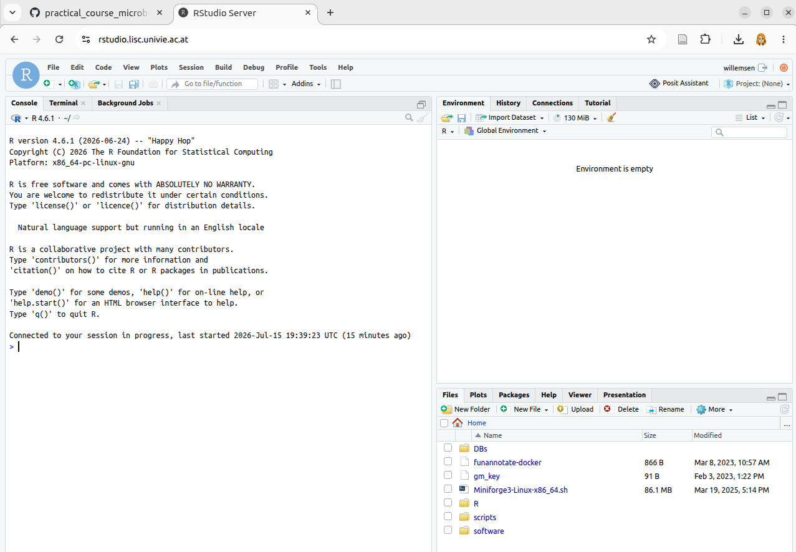

# Exercise_2: Analyse digital PCR data

In this exercise, you will analyse the experimental data you obtained from the digital PCR machine. There are many ways to analyse the data. In this exercise, you will be provided with a very simple script to analyse your data in R. Feel free to improve this script or even write your own in your preferred language (R, Python, ...)

We will be using the RStudio Server hosted by LiSC at [https://rstudio.lisc.univie.ac.at](https://rstudio.lisc.univie.ac.at).
The login credentials for the RStudio Server are the same as those for logging in to the LiSC login nodes. Make sure your network address has LiSC access.
If you have R or RStudio installed locally, you can, of course, also use them. 

After logging in, you should see this 

 
